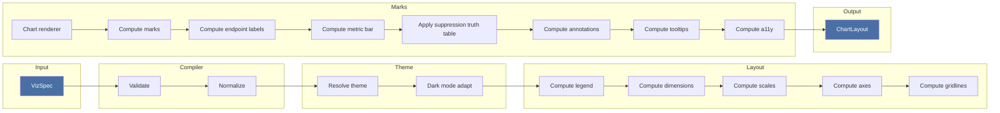
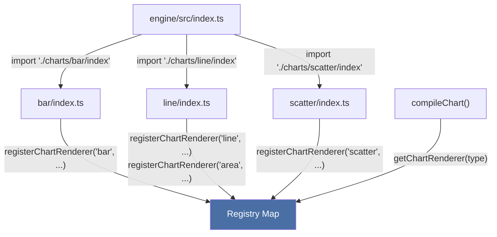
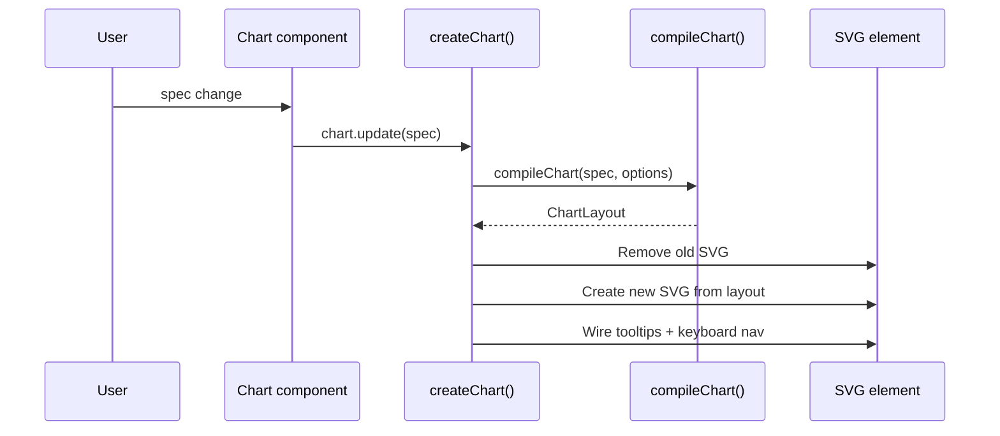

# Architecture

How the openchart packages fit together, what the compilation pipeline does, and why the library is structured this way. Intended for contributors and anyone curious about the internals.

## Package dependency graph

```
                              ┌── react
core  <──  engine  <──  vanilla  <──┤── vue
                              └── svelte
```

| Package | Responsibility | DOM? |
|---------|---------------|------|
| `core` | Types, theme engine, color system, accessibility, locale, text measurement | No |
| `engine` | Headless compiler. Spec in, layout out. Pure math and data transformation. | No |
| `vanilla` | Imperative DOM rendering. SVG charts, HTML tables, canvas graphs, tooltips, resize observer. | Yes |
| `react` | Thin React wrappers around vanilla with lifecycle management. | Yes |
| `vue` | Vue 3 components with composition API. Same contract as react, different reactivity system. | Yes |
| `svelte` | Svelte 5 components using rune-based reactivity. Same contract as react, different framework. | Yes |

Dependencies are strictly one-directional. Core imports from nothing. Engine imports from core. Vanilla imports from engine and core. The framework packages (react, vue, svelte) import from vanilla, engine, and core. If you find yourself importing upstream, the design is wrong.

Each package re-exports core types for consumer convenience, so users typically only import from one package.

## Compilation pipeline

The engine is the heart of the library. It takes a raw spec (plain JSON object) and produces a fully resolved layout object with computed positions, colors, and marks ready for rendering.

### Chart compilation



Step by step:

1. **Validate**: Runtime type checking of the raw spec. Catches missing fields, wrong types, invalid encoding combinations. On a missing data field, the validator suggests the nearest real column name (Levenshtein) so the error tells the author how to fix it.
2. **Normalize**: Fill in defaults, resolve shorthand, produce a `NormalizedChartSpec` with all optional fields resolved. This stage also expands spec sugar (Vega-Lite idioms, bin/timeUnit) and collects deprecation warnings. The engine never calls `console.*`; it returns a structured warnings array that the vanilla adapter surfaces once at its boundary (see Compile warnings below).
3. **Resolve theme**: Deep-merge user theme overrides onto the default theme. Produces a `ResolvedTheme` with every property set.
4. **Dark mode adapt**: If dark mode is active, transform colors (lighten backgrounds, adjust palette brightness, swap text colors).
5. **Compute legend**: Determine legend entries from the color encoding. Calculate space needed for legend positioning. Categorical color produces swatch entries; a quantitative color scale produces a continuous legend instead, either a gradient bar (sequential/diverging scales) or discrete swatches with class breaks (binned scales like quantile/quantize/threshold).
6. **Compute dimensions**: Account for chrome (title, subtitle, source, footer), legend, axis labels. Produce the chart area `Rect`.
7. **Compute scales**: Build d3 scales from the data and encoding. Linear for quantitative, time for temporal, band/ordinal for nominal.
8. **Compute axes**: Generate tick positions, labels, and format strings from the scales. Responsive strategy controls label density.
9. **Compute gridlines**: Position gridlines aligned to y-axis ticks.
10. **Chart renderer**: Look up the registered renderer for the chart type. Compute mark positions (line paths, bar rects, arc segments, etc.).
11. **Compute endpoint labels**: For line/area charts with `layout.endpointLabels` enabled, place a chip+swatch label at each series' trailing point. A capped iterative sweep (`endpoint-labels/compute.ts`) resolves vertical overlaps and clamps to the chart edges so the tail label never falls off-canvas.
12. **Compute metric bar**: When `chrome.metrics` is set, lay out the chrome metric pills (label + value + delta) so the renderer can paint them above the chart area.
13. **Apply suppression truth table**: A single source of truth (`legend/suppression.ts`) decides what disappears for each hidden series — endpoint label, leader line, dot annotation, and series-anchored text annotations all consult the same table so legend toggles, `hiddenSeries`, and runtime hides never disagree.
14. **Compute annotations**: Map annotation specs (reference lines, ranges, text callouts) to pixel positions using the scales.
15. **Compute tooltips**: Build tooltip content descriptors keyed by mark ID.
16. **Compute a11y**: Generate alt text, ARIA labels, and a screen-reader data table from the spec and data.

The output is a `ChartLayout` with everything the renderer needs: positioned marks, resolved chrome, axes, gridlines, annotations, tooltips, accessibility metadata, and the resolved theme.

### Table compilation

Tables follow a similar validate-normalize-theme pipeline, then run a different set of computations:

1. Column resolution (match columns to data, apply defaults)
2. Search filtering (if search is active)
3. Sorting (by active column and direction)
4. Pagination (slice to current page)
5. Cell formatting (number/date format strings)
6. Visual enhancement computation (heatmap scales, bar widths, sparkline data)

The output is a `TableLayout` with resolved columns, formatted rows, cell styles, pagination state, and sort state.

### Graph compilation

Graphs follow the same validate-normalize-theme pipeline as charts, then run a different set of computations:

1. Node visual resolution (size, color from encoding with optional explicit scale, label text)
2. Community assignment (grouping nodes by clustering field for spatial layout)
3. Community coloring (only when no `nodeColor` encoding is set; encoding takes precedence)
4. Edge visual resolution (width, color, style)
5. Simulation config (charge strength, link distance, clustering parameters)
6. Legend, tooltips, and a11y metadata

The key difference from charts: the engine output does **not** include x/y positions. Node positioning is handled by a force simulation running in a web worker inside the vanilla adapter. The engine resolves visual properties and simulation parameters, then the adapter runs the physics at runtime.

The output is a `GraphCompilation` with resolved nodes, edges, simulation config, legend, tooltip descriptors, and the resolved theme. The vanilla adapter creates a canvas element and an animation loop driven by simulation ticks.

Graphs use a separate compilation function (`compileGraph`) rather than the chart registry. The chart registry handles the mark types that all share the same scale/axis/mark pipeline. Graphs have fundamentally different input (nodes + edges instead of rows + encoding) and output (simulation config instead of positioned marks), so they get their own path.

## Why headless

The engine knows nothing about the DOM, React, or any rendering target. This is intentional:

- **SSR**: The engine runs in Node.js. `renderStaticSVG()` from `@opendata-ai/openchart-vanilla/static` generates standalone SVG strings server-side using happy-dom as a DOM shim.
- **Testing**: Engine output is pure data. Test chart layout math without a browser.
- **Multiple renderers**: The same spec and layout can be rendered by the vanilla SVG adapter, the React wrapper, the Vue wrapper, the Svelte wrapper, or a hypothetical Canvas/WebGL renderer.
- **LLM generation**: Specs are plain JSON. An LLM writes data, the engine does the math, an adapter renders. A JSON Schema for the full spec is published from core's `./schema` subpath (with `additionalProperties: false`, so hallucinated fields and unknown marks are rejected when the schema constrains a model's tool output), and a `llms.txt` summary ships at the repo root. Both are generated from the TS spec types, and a CI check fails the build if either drifts from the types.

The boundary between "compute" and "render" is the layout type. Everything before it is engine territory. Everything after is adapter territory.

## Compile warnings

The engine surfaces non-fatal problems (deprecated spec forms, accessibility contrast issues, ambiguous encodings) as a structured warnings array on its output, never by calling `console.*` itself. Keeping the engine free of side-effect logging is what lets it stay isomorphic and testable. The vanilla adapter is the single boundary that emits these to the console, deduped per compile, so a warning appears once no matter how many internal stages produced it. Deprecation warnings name both the deprecated form and its replacement so the message is self-documenting.

## Interaction layers

A few features add runtime interactivity on top of a rendered chart. These live in the vanilla adapter (not the engine, which stays headless) and are wired through `mount.ts` with a create/update/destroy lifecycle that mirrors the chart itself:

- **seriesSearch**: a "find your series" search box over a dense multi-series line chart. Matching series highlight, the rest mute.
- **youDrawIt**: an NYT-style draw-then-reveal. The reader draws their guess for the hidden portion of a line, then reveals the real data. Reports the drawn values in data coordinates via an `onReveal` callback.
- **scrollytelling story API**: a separate vanilla subpath export (`@opendata-ai/openchart-vanilla/story`) that drives a chart through a sequence of narrative steps, each a cumulative patch on a base spec, with camera moves and morph/crossfade transitions between steps. Kept out of the main bundle so charts that don't need it don't pay for it.

Because these are adapter-level, all three framework wrappers inherit them through vanilla. Where two interaction layers would conflict (for example youDrawIt and edit mode), the adapter resolves the conflict explicitly at mount time and warns once.

### Why three framework packages?

React, Vue, and Svelte all wrap the same vanilla adapter. The framework packages are thin: they manage lifecycle (mount, update, destroy), wire up reactivity, and provide framework-idiomatic APIs (React hooks, Vue composables, Svelte actions). The rendering logic lives entirely in vanilla. If vanilla gets a new feature, all three frameworks get it automatically.

## Chart registry pattern

Chart types register themselves via side-effect imports. When `engine/src/index.ts` imports `./charts/bar/index`, the bar module runs `registerChartRenderer('bar', barRenderer)` at module load time.



This decouples chart-type logic from the compile pipeline. Adding a new chart type means creating a directory under `charts/`, implementing a renderer function, and importing it in `index.ts`. The compile pipeline doesn't change.

Each chart renderer receives `(spec, scales, chartArea, strategy)` and returns `Mark[]`. A `Mark` is a discriminated union (line marks, rect marks, arc marks, point marks, text marks, rule marks) with all positions and colors computed. Higher-level marks compose from these primitives rather than inventing new geometry: for example, `parliament` (a hemicycle seat chart) emits point marks for the seats, a rule mark for the majority line, and text marks for labels; `waffle` emits a grid of rects.

Some marks are axisless: arc, waffle, calendar, and parliament compute their own internal geometry and have no positional x/y scales, axes, or gridlines. The single predicate `isAxislessMark()` gates the axis/gridline/dimension code paths for all of them, so the pipeline skips axis space and tick computation uniformly rather than special-casing each mark.

## Table pipeline

Tables use a different pattern. Instead of a registry, the table compiler directly orchestrates the column resolution, sort/search/pagination, and cell enhancement pipeline. Cell types are a discriminated union on `cellType` (text, heatmap, bar, sparkline, image, flag, category).

Visual features are computed per-column based on the column config: heatmap builds a color scale from the column's numeric values, bar computes widths relative to a max value, sparkline extracts array data from a related field.

## Rendering strategy

The vanilla adapter renders charts by building a fresh SVG element from the `ChartLayout`. It doesn't diff or patch. On every update or resize, it tears down the old SVG and creates a new one.

Scatter charts past a point-count threshold render their dots on a `<canvas>` instead (see [canvas mark mode](spec-reference.md#canvas-mark-mode)). The canvas is a sibling inserted *before* the SVG and painting the background, gridlines and marks; the SVG keeps axes, trendline, annotations and chrome. The engine only records the decision as `ChartLayout.markRenderMode` -- the renderer keys strictly on its own `canvasMarks` option, so any caller that omits it (SSR, exports) gets a complete SVG regardless of what the layout says.

For tables, it creates HTML elements (table, thead, tbody, etc.) with interactivity wired up: sort headers, search input, pagination controls, keyboard navigation.

Both adapters use `ResizeObserver` to detect container size changes and trigger recompilation at the new dimensions. The responsive system uses breakpoints to adjust layout strategy (label density, legend position, annotation placement).

### Update flow



## Theme resolution

Themes flow through three stages:

1. **User config** (`ThemeConfig`): Partial overrides. Only specify what you want to change.
2. **Deep merge** (`resolveTheme()`): Merge user config onto `DEFAULT_THEME`. Produces a `ResolvedTheme` with every field set.
3. **Dark mode adaptation** (`adaptTheme()`): If dark mode is active, transform the resolved theme. Swap background/text, adjust palette brightness, lighten gridlines.

The default theme uses Inter as the primary font, editorial typography hierarchy (22px title, 15px subtitle, 13px body, 11px axis ticks), and a categorical palette tuned for distinguishability.

Themes can be applied per-component (via prop) or globally (via `VizThemeProvider` in React, or the `theme` option in vanilla).

## Accessibility

The engine generates accessibility metadata as part of compilation:

- **Alt text**: Auto-generated description of the chart (type, data summary, encoding).
- **Data table fallback**: A screen-reader-only HTML table with the chart's data.
- **ARIA labels**: Role, roledescription, and label attributes for the SVG container.
- **Keyboard navigation**: Arrow keys navigate between marks. Enter/Space shows tooltip. Escape hides it.

The vanilla adapter creates a visually-hidden data table alongside the SVG, and wires keyboard event handlers on the container. React components inherit this through the vanilla adapter.
